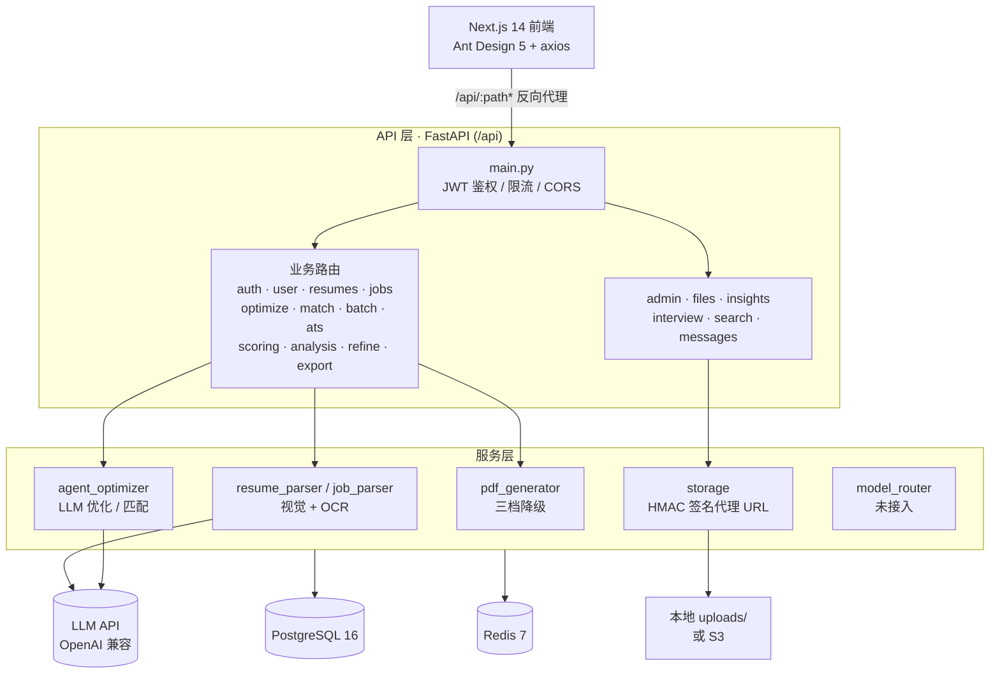
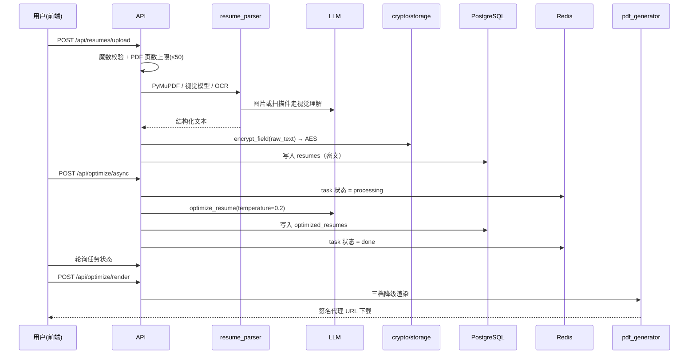

# 智能简历优化系统 · 项目概述 (Smart Resume)

> 上传简历 + 岗位需求 → AI 解析、匹配分析、逐段优化 → 渲染为专业排版的 PDF / Word。

面向求职者的 **SaaS 化简历优化平台**：除核心的「解析 → 优化 → 导出」链路外，还包含人岗匹配度评分、
ATS 兼容性检测、面试模拟、批量优化、feedback 闭环，以及配套的管理员后台、配额套餐与工单支持。

前后端分离，后端 FastAPI（Python 3.12），前端 Next.js 14（App Router + React 18 + Ant Design 5）。

> 想直接跑起来看效果？请阅读同目录的 **`README.md`（项目使用方法）**，本文只讲「系统是什么」。

---

## 核心能力

| 能力 | 入口模块 | 状态 |
| --- | --- | --- |
| 简历解析（PDF / 图片 / 文档 → 结构化文本） | `services/resume_parser.py` | 已接入（视觉模型 + PaddleOCR 兜底） |
| 简历智能优化 | `api/optimization.py` + `services/agent_optimizer.py` | 已接入 |
| 岗位 JD 解析（截图 / 文本） | `services/job_parser.py` | 已接入 |
| 人岗匹配度分析 | `api/matching.py` | 已接入 |
| ATS 兼容性检测 | `api/ats.py` | 已接入 |
| 简历评分 / 岗位趋势 | `api/scoring.py` | 已接入 |
| 优化前后的规则聚合分析 | `api/analysis.py` | 已接入（纯规则，不消耗 AI 额度） |
| 面试模拟（题目生成 / 收藏 / 笔记） | `api/interview.py` | 已接入 |
| 批量优化 | `api/batch.py` | 已接入 |
| Word / PDF 导出 | `api/export.py` + `services/docx_export.py` + `services/pdf_generator.py` | 已接入（渲染三档降级） |
| 管理员后台（提示词 / 模型路由 / 关键词 / ATS 规则 / 工单 / 订单 / 配额） | `api/admin.py`（51 个端点） | 已接入 |
| 模型路由、提示词模板在线配置 | `services/model_router.py`、`prompt_templates` 表 | **已建表但未接入业务链路** |
| CI | `.github/workflows/ci.yml` | 已接入（自包含 pytest） |

---

## 技术栈

### 后端

| 类别 | 选型 |
| --- | --- |
| Web 框架 / 服务器 | FastAPI + Uvicorn |
| ORM / DB 驱动 | SQLAlchemy 2.0（async）+ asyncpg |
| 数据库 | PostgreSQL 16（JSONB 承载半结构化字段） |
| 缓存 / 任务状态 / 限流 | Redis 7 |
| 鉴权 | JWT（python-jose，HS256）双 Token |
| 密码哈希 | bcrypt（passlib） |
| LLM SDK | `openai`（AsyncOpenAI，走 OpenAI 兼容协议） |
| PDF 渲染 | Playwright/Chromium → WeasyPrint → ReportLab（三档降级） |
| PDF 解析 / OCR | PyMuPDF；PaddleOCR（默认关闭） |
| 文档处理 | python-docx、pdf2docx、pylatex、Jinja2 |
| 字段加密 | AES-256-CBC（密钥派生自 `SECRET_KEY`） |
| 迁移 | Alembic |
| 异步任务 | Celery（**已声明未接入**，见[技术债](#已知限制与技术债)） |

### 前端

| 类别 | 选型 |
| --- | --- |
| 框架 | Next.js 14（App Router，`output: 'standalone'`） |
| UI / 语言 | Ant Design 5 + React 18 + TypeScript |
| 请求 | axios（统一封装于 `src/lib/api.ts`） |
| 图表 / 对比 | ECharts（echarts-for-react）、diff |
| 上传 | react-dropzone |

### 大模型

- 接入方式：OpenAI 兼容协议（`base_url` + `api_key`）。
- 模型由 `settings.LLM_MODEL_TEXT` / `LLM_MODEL_VISION` 决定；部署时以 `.env` 覆盖。
- 优化温度固定 `0.2`（硬编码于 `agent_optimizer._call_with_retry`）。
- **无有效 Key 时自动走 Mock 兜底**，可在无网环境联调 UI 与流程。

---

## 系统架构



### 关键架构决策

- **异步优先**：API 全面 async（SQLAlchemy async + asyncpg + `AsyncOpenAI`），不阻塞事件循环。
- **PII 保护**：后端**不挂载** `/uploads` 静态目录；文件只能通过 HMAC 签名代理 URL
  （`/api/files/{key}?exp=&sig=`）访问；`raw_text` 入库前 AES 加密；日志经脱敏过滤器。
- **自愈降级**：LLM 无 Key → Mock；PDF 渲染 Playwright → WeasyPrint → ReportLab。
- **进程内异步任务**：`/optimize/async` 用 `asyncio.create_task` + Redis 状态轮询，未走 Celery。

---

## 项目结构

```
智能简历 - 副本 (2)/
├── backend/                        # FastAPI 后端
│   ├── app/
│   │   ├── main.py                 # 入口：注册 19 个路由模块 + 日志脱敏 + create_all
│   │   ├── config.py               # Settings(BaseSettings)，env_file=".env"
│   │   ├── database.py             # engine / Base（async）
│   │   ├── api/                    # 路由层（21 个模块，约 149 个端点）
│   │   ├── models/                 # ORM 模型（26 张表）
│   │   ├── schemas/                # Pydantic 请求/响应模型
│   │   ├── services/               # 业务服务（解析 / 优化 / 渲染 / 存储 / 模型路由…）
│   │   ├── core/                   # security · deps · crypto · errors · file_security · log_filter
│   │   └── prompts/                # LLM Prompt 模板
│   ├── tests/                      # pytest（含 CI 运行的 test_nonai_features.py）
│   ├── alembic/                    # 迁移脚本
│   ├── run.py                      # 启动入口（处理 Windows ProactorEventLoop）
│   ├── celery_worker.py            # Celery app（已声明，API 未调用）
│   ├── requirements.txt            # 完整依赖
│   └── requirements-light.txt      # 轻量依赖（CI 用，无需 OCR/Playwright）
├── frontend/                       # Next.js 14 前端
│   └── src/
│       ├── lib/api.ts              # axios 客户端 + 全部接口封装
│       ├── app/                    # 21 个页面（/ · /resumes · /jobs · /match · /batch
│       │                           #   /ats · /scoring · /interview · /admin · /history …）
│       ├── components/             # 通用组件 + components/optimize/ + components/ios/
│       └── types/                  # TypeScript 类型
├── docker/
│   ├── docker-compose.yml          # db / redis / backend / celery_worker / frontend
│   └── nginx.conf
├── docs/
│   └── PROJECT_DOCUMENTATION.md    # 代码级完整项目文档（推荐深入阅读）
├── public.sql                      # 数据库建表 SQL（24 张表）
├── 补充测试数据.sql                # 演示 / 测试数据
├── restart_backend.bat / stop_all.bat
└── README.md
```

---

## 核心流程

### 上传 → 解析 → 优化 → 渲染



### 鉴权（双 Token）

手机号 + 验证码注册 → 登录签发 `access`(2h) + `refresh`(7d) → Bearer 访问业务接口 →
`access` 过期用 `/api/auth/refresh` 换新 → 支持设备管理与注销（30 天冻结）。

> 注：登录成功后的落地页为「首页」`/dashboard`（而非「优化」页 `/`）。

---

## 数据模型

共 **26 张表**（ORM 模型）；字段定义以 `public.sql` 为准。

| 域 | 表 |
| --- | --- |
| 账户 | `users` `user_devices` `admins` `verification_codes` `user_quotas` |
| 简历与岗位 | `resumes`（`raw_text` 密文） `optimized_resumes` `job_images` `resume_templates` |
| 优化与任务 | `batch_optimizations` `batch_job_tasks` `feedbacks` |
| 面试 | `interview_sessions` `interview_questions` |
| 运营 | `orders` `quota_packages` `support_tickets` `ticket_replies` `messages` |
| 配置（部分未接入） | `prompt_templates` `model_routing` `ats_rules` `industry_keywords` |
| 审计 | `audit_logs` `admin_logs` `ai_model_call_logs` |

主要关系：`users` 1—N `resumes` / `user_devices` / `user_quotas` / `audit_logs`；
`resumes` 1—N `optimized_resumes`；`batch_optimizations` 1—N `batch_job_tasks`。

---

## API 概览

统一前缀 `/api`，鉴权接口一律 Bearer access token。路线注册见 `backend/app/main.py`。

| 前缀 | 代表端点 | 说明 |
| --- | --- | --- |
| `/api/auth` | `POST /register` `POST /login` `POST /refresh` `GET /devices` | 注册 / 登录 / 双 Token / 设备管理（13 个端点） |
| `/api/user` | `GET /profile` `PUT /profile` `POST /avatar` `GET /export-data` | 个人资料（8） |
| `/api/resumes` | `POST /upload` `GET /stats` `GET /trash` `POST /batch-delete` | 简历 CRUD / 收藏 / 回收站（13） |
| `/api/jobs` | `POST /upload` `GET /categories` `PUT /{id}/primary` | 岗位 JD 管理与解析（16） |
| `/api/optimize` | `POST /` `POST /quick` `GET /diff` `POST /render` | 优化核心链路（20） |
| `/api/match` | `POST /` `POST /rank` | 人岗匹配度（2） |
| `/api/analysis` | `POST /resume` | 规则型聚合分析，不落库、不耗 AI 额度（1） |
| `/api/batch-optimize` · `/api/batch/{id}/status` | — | 批量优化（2） |
| `/api/ats` | `POST /check` | ATS 兼容性检测（1） |
| `/api/resume/{id}/score` · `/api/jobs/trending` | — | 评分与趋势（2） |
| `/api/optimization/{id}/refine` | — | 精炼改写（1） |
| `/api/interview` | `POST /generate` `GET /sessions` `GET /bookmarks` | 面试模拟（7） |
| `/api/export` | `GET /optimize/{id}/docx` `GET /resume/{id}/docx` | Word 导出（2） |
| `/api/insights` | `GET /overview` | 数据洞察（1） |
| `/api/search` | `GET ""` | 站内搜索（1） |
| `/api/feedback` | `POST /` `GET /stats` | 反馈闭环（3） |
| `/api/messages` | `GET ""` `PUT /read-all` | 站内消息（4） |
| `/api/files/{key}` | — | HMAC 签名代理下载（1） |
| `/api/admin` | `POST /login` `GET /users` `POST /templates` … | 管理后台（51） |

> 合计约 **149 个端点**。错误码统一由 `core/errors.py` 的 `app_err(code)` 返回中文码，
> 如 `RESUME_NOT_FOUND`、`FILE_TOO_LARGE`、`PARSE_BEFORE_OPTIMIZE`、`QUOTA_EXCEEDED`。

---

## 已知限制与技术债

| # | 项 | 现状 | 影响 |
| --- | --- | --- | --- |
| 1 | 模型路由未接入 | `model_router.py` 已建，但优化链路直接用 `settings.LLM_MODEL_TEXT` | 无动态路由 / 熔断 |
| 2 | 提示词模板未接入 | `prompt_templates` 表 + `prompt_service` 未进入优化链路 | 管理员无法在线调提示词 |
| 3 | Celery 被绕过 | `celery_worker.process_optimization` 未被 API 调用，改用 `asyncio.create_task` | 进程重启丢任务、无分布式队列 |
| 4 | 可观测性仅日志 | 无 metrics / tracing / alerting | 生产排障困难 |
| 5 | 删除账户无自动清理 | 30 天冻结 + Celery 未启用 | 冻结数据可能永不清理 |
| 6 | `.env.example` 含真实密钥 | 见 `README.md`「安全」节 | 凭证被盗用风险 |
| 7 | 测试覆盖有限 | CI 仅跑 `test_nonai_features.py` | 需 DB / Redis / LLM 的用例未纳入 |
| 8 | 部分历史文档过时 | 根目录诊断类文档为旧版结论 | 以 `docs/PROJECT_DOCUMENTATION.md` 为准 |

---

_本概述依据当前代码、配置与 CI 实测整理；代码为唯一事实来源，如有冲突以代码为准。_
